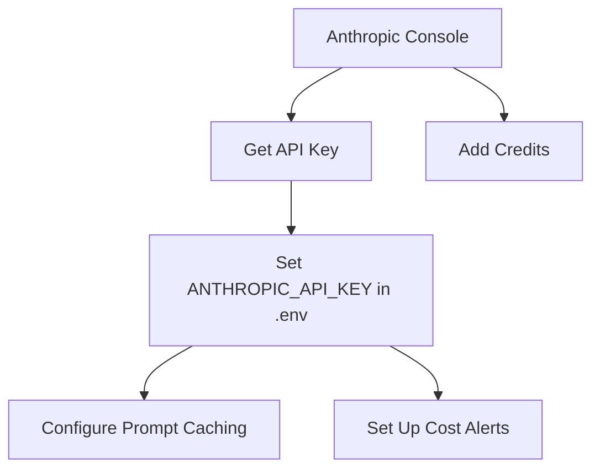
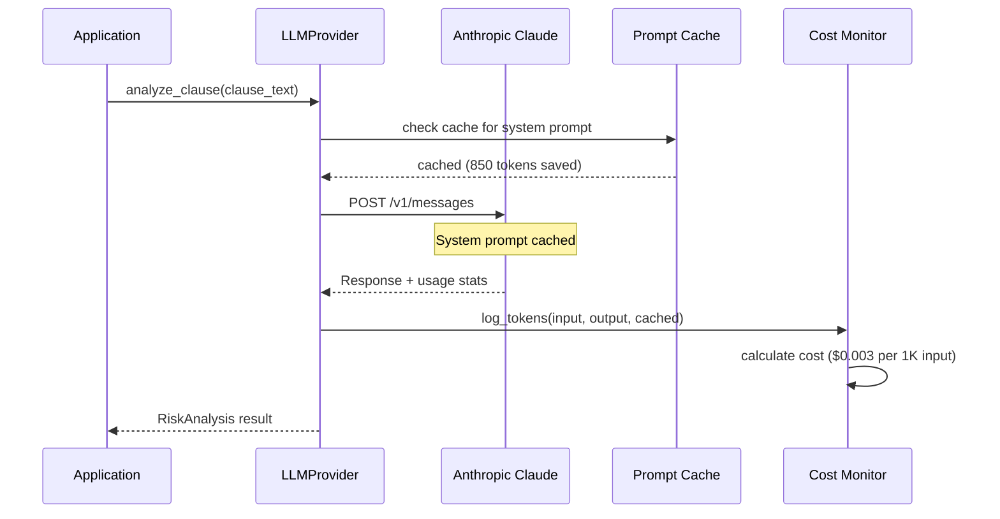
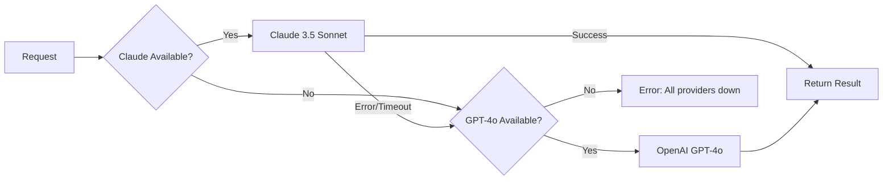

# Anthropic (Claude) — Primary LLM Provider

## Overview

Anthropic's Claude 3.5 Sonnet is the primary LLM for the AI Contract Risk Analyzer. It powers risk clause flagging, AI redline suggestions, severity scoring, and rationale generation. The integration includes prompt caching for cost optimization, provider failover to OpenAI, and comprehensive token tracking.

---

## Configuration

### Environment Variables

| Variable | Description | Required |
|---|---|---|
| `ANTHROPIC_API_KEY` | Anthropic API key (starts with `sk-ant-`) | ✅ |
| `ANTHROPIC_MODEL` | Model name (default: `claude-3-5-sonnet-20241022`) | ❌ |
| `ANTHROPIC_MAX_TOKENS` | Max output tokens (default: `4096`) | ❌ |
| `ANTHROPIC_TEMPERATURE` | Temperature for generation (default: `0.3`) | ❌ |

### Auth0 Setup Steps



#### 1. Get an API Key
1. Go to https://console.anthropic.com
2. Sign up or log in
3. Go to **API Keys** → **Create Key**
4. Name it `Contract Risk Analyzer`
5. Copy the key (starts with `sk-ant-`)

#### 2. Add Credits
- Go to **Billing** → **Add Credits**
- Start with $20–$50 for development
- Set up **Spend Limits** to avoid unexpected costs

#### 3. Enable Prompt Caching
Prompt caching is enabled via the `anthropic-beta: prompt-caching-2024-07-31` header. This caches system prompts and reduces costs by ~90% for repeated calls with the same system prompt.

---

## API Endpoints

### Anthropic Messages API

| Method | Endpoint | Description |
|---|---|---|
| `POST` | `https://api.anthropic.com/v1/messages` | Send a message to Claude |
| `POST` | `https://api.anthropic.com/v1/messages?stream=true` | Stream response tokens |
| `GET` | `https://api.anthropic.com/v1/models` | List available models |

### Request Format

```json
{
  "model": "claude-3-5-sonnet-20241022",
  "max_tokens": 4096,
  "temperature": 0.3,
  "system": [
    {
      "type": "text",
      "text": "You are an expert commercial attorney...",
      "cache_control": { "type": "ephemeral" }
    }
  ],
  "messages": [
    {
      "role": "user",
      "content": [
        {
          "type": "text",
          "text": "Analyze this clause for risk..."
        }
      ]
    }
  ]
}
```

### Response Format

```json
{
  "id": "msg_01ABC123...",
  "type": "message",
  "role": "assistant",
  "content": [
    {
      "type": "text",
      "text": "{\"risk_category\": \"liability_exposure\", ...}"
    }
  ],
  "model": "claude-3-5-sonnet-20241022",
  "stop_reason": "end_turn",
  "usage": {
    "input_tokens": 1250,
    "cache_creation_input_tokens": 0,
    "cache_read_input_tokens": 850,
    "output_tokens": 320
  }
}
```

---

## Integration Architecture



### Key Components

| Component | File | Purpose |
|---|---|---|
| `LLMClient` | `api/llm/client.py` | High-level client with provider abstraction |
| `ClaudeProvider` | `api/llm/provider.py` | Anthropic-specific implementation |
| `OpenAIProvider` | `api/llm/provider.py` | Fallback GPT-4o implementation |
| `PromptCache` | `api/llm/cache.py` | Semantic caching for prompts |
| `CostMonitor` | `api/llm/monitoring.py` | Token and cost tracking |

---

## Prompt Templates

### System Prompt (Cached)

The system prompt establishes Claude as a specialized commercial attorney:

```
You are an expert commercial attorney specializing in contract risk analysis.
You have 15+ years of experience reviewing NDAs, MSAs, SaaS agreements, and
procurement contracts. Your task is to analyze contract clauses for risk,
assign severity scores, and suggest improved language.

RISK TAXONOMY (12 categories):
1. Liability Exposure - Limitation of liability, indemnification
2. Termination Rights - Notice periods, auto-renewal
3. IP & Data Ownership - Assignment, data license
4. Payment & Financial - Terms, late fees, escalation
5. Governing Law - Jurisdiction, venue, arbitration
6. Confidentiality - NDA scope, duration, carve-outs
7. Force Majeure - Scope, pandemic clauses
8. Compliance & Regulatory - GDPR, CCPA, AML
9. Change of Control - Assignment restrictions
10. SLA & Performance - Uptime, remedies, credits
11. Non-Compete / Exclusivity - Scope, duration
12. ESG / Sustainability - Carbon, DEI, labor

OUTPUT FORMAT:
Always respond with valid JSON matching the requested schema.
Never include markdown code blocks around JSON in your response.
```

### Risk Analysis Prompt Chain

The chain consists of 4 steps, each with a specialized prompt:

#### Step 1: Clause Classification
```
Classify the following clause text into ONE of the 12 risk categories above.
Output as JSON: {"category": "string", "sub_type": "string", "confidence": 0.0-1.0}
Clause: {clause_text}
```

#### Step 2: Risk Assessment
```
Assess the specific risk present in this {category} clause.
Consider: (a) Is the clause one-sided? (b) Does it deviate from market standard?
(c) What is the financial exposure? (d) Are there missing protections?
Clause: {clause_text}
Output as JSON: {"risk_present": bool, "risk_description": "string", "market_standard": "string"}
```

#### Step 3: Severity Scoring
```
Score the risk severity from 1-10:
1-3: Minor/standard language, low risk
4-6: Moderate risk, warrants attention during negotiation
7-9: Significant risk, strongly recommend negotiation
10: Critical risk, do not sign without changes
Consider: deal_size={deal_size}, industry={industry}, party_role={party_role}
Output as JSON: {"severity": 1-10, "reasoning": "string", "confidence": "low|medium|high"}
```

#### Step 4: Rationale Generation
```
Write a 2-4 sentence plain-English explanation of why this clause is risky.
Target audience: A non-lawyer CFO who needs to understand the business impact.
Avoid legal jargon. Focus on: what the risk is, why it matters, what to do.
Output as JSON: {"rationale": "string", "suggested_action": "negotiate|remove|accept|legal_review"}
```

---

## Cost Tracking

### Pricing (as of May 2026)

| Model | Input (per 1K tokens) | Output (per 1K tokens) | Cache Read (per 1K tokens) |
|---|---|---|---|
| Claude 3.5 Sonnet | $0.003 | $0.015 | $0.00030 |
| Claude 3.5 Sonnet (with caching) | $0.003 | $0.015 | 90% reduction |

### Cost per Operation

| Operation | Avg Input Tokens | Avg Output Tokens | Est. Cost |
|---|---|---|---|
| Clause Classification | 1,200 | 50 | $0.004 |
| Risk Assessment | 1,500 | 200 | $0.007 |
| Severity Scoring | 1,500 | 100 | $0.006 |
| Rationale Generation | 1,200 | 150 | $0.006 |
| **Full Chain (4 steps)** | **5,400** | **500** | **$0.023** |
| Redline Suggestion | 2,500 | 800 | $0.020 |
| **Per Contract (avg 20 clauses)** | **~108,000** | **~10,000** | **~$0.46** |

### Cost Monitoring

```python
# Logged to PostgreSQL for every LLM call
{
    "request_id": "req_abc123",
    "provider": "anthropic",
    "model": "claude-3-5-sonnet-20241022",
    "input_tokens": 1250,
    "output_tokens": 320,
    "cache_creation_tokens": 0,
    "cache_read_tokens": 850,
    "cost_usd": 0.00855,
    "duration_ms": 2340,
    "tenant_id": "tenant_abc",
    "endpoint": "risk_analysis"
}
```

---

## Provider Failover

When Claude is unavailable or slow, the system automatically falls back to OpenAI GPT-4o:



### Failover Triggers

| Condition | Action |
|---|---|
| HTTP 500/503 from Anthropic | Immediate failover to OpenAI |
| HTTP 429 (rate limited) | Wait 5s, retry, then failover |
| Latency > 10 seconds | Failover to OpenAI |
| 3 consecutive failures | Circuit breaker opens (60s cooldown) |

---

## Prompt Caching Strategy

### What Gets Cached

| Cache Entry | TTL | Est. Savings |
|---|---|---|
| System prompt (legal persona + taxonomy) | 5 minutes | 90% on repeated calls |
| Risk category definitions | 5 minutes | 80% on same-category calls |
| Few-shot examples | 5 minutes | 85% on same clause type |

### Cache Headers

```python
headers = {
    "anthropic-version": "2023-06-01",
    "anthropic-beta": "prompt-caching-2024-07-31",
    "x-api-key": ANTHROPIC_API_KEY,
}
```

---

## Testing

### Test API Connection

```bash
curl -s https://api.anthropic.com/v1/messages \
  -H "Content-Type: application/json" \
  -H "x-api-key: $ANTHROPIC_API_KEY" \
  -H "anthropic-version: 2023-06-01" \
  -d '{
    "model": "claude-3-5-sonnet-20241022",
    "max_tokens": 100,
    "messages": [
      {"role": "user", "content": "Say hello in JSON format: {\"greeting\": \"...\"}"}
    ]
  }' | python3 -m json.tool
```

### Test with Python

```bash
cd /Volumes/home/ContractRiskEdge
python3 << 'EOF'
from api.llm.client import LLMClient

client = LLMClient(
    anthropic_key="sk-ant-your-key",
    openai_key="sk-your-key",
)

result = await client.analyze_clause(
    clause_text="Liability of either party shall not exceed $100",
    clause_type="liability_exposure",
)
print(f"Category: {result.category}")
print(f"Severity: {result.severity}")
print(f"Rationale: {result.rationale}")
EOF
```

---

## Common Issues

| Issue | Cause | Fix |
|---|---|---|
| `401 Authentication Error` | Invalid API key | Check `ANTHROPIC_API_KEY` in `.env` |
| `429 Rate Limit` | Too many requests | Implement backoff; enable caching |
| `529 Overloaded` | Anthropic server busy | Wait 30s and retry; failover to OpenAI |
| `Cost too high` | No caching enabled | Enable `anthropic-beta: prompt-caching` header |
| `JSON parse error` | Model returned non-JSON | Add explicit JSON instruction to prompt |
| `Context too long` | Contract exceeds 200K tokens | Use RAG chunking; summarize before sending |

---

## Related Files

| File | Purpose |
|---|---|
| `api/llm/client.py` | High-level LLM client with provider abstraction |
| `api/llm/provider.py` | Claude and OpenAI provider implementations |
| `api/llm/cache.py` | Prompt caching with Anthropic's cache API |
| `api/llm/monitoring.py` | Token/cost tracking and Datadog metrics |
| `api/risk_engine/chain.py` | Risk analysis prompt chain orchestration |
| `api/risk_engine/severity.py` | Severity scoring with calibration |
| `api/redline/prompts.py` | Redline suggestion prompt templates |
| `docs/api-details/OPENAI.md` | OpenAI fallback provider documentation |
