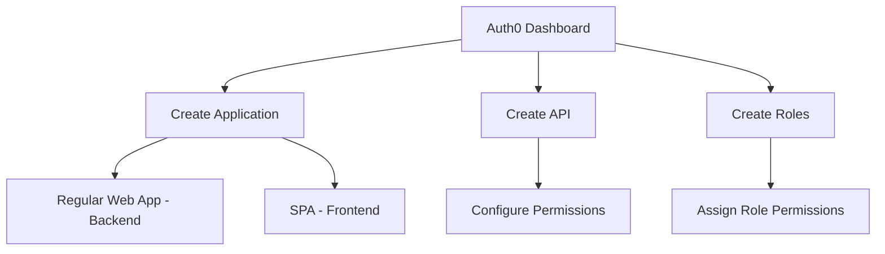
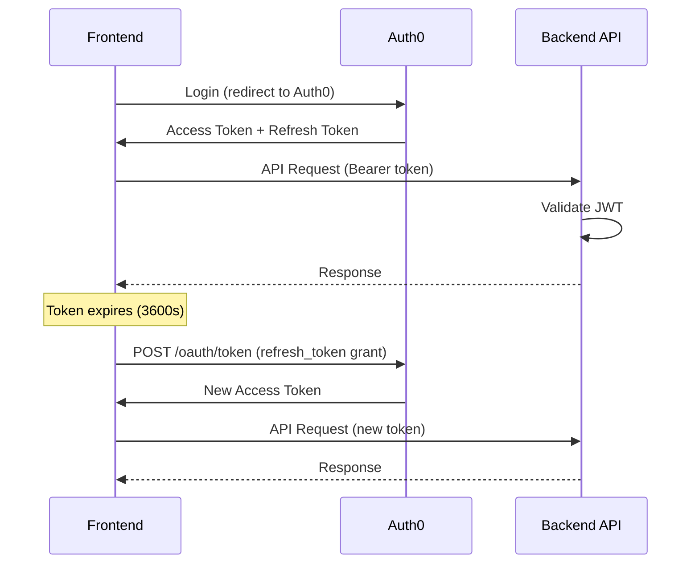

# Auth0 — Authentication & Authorization

## Overview

Auth0 provides authentication, single sign-on (SSO), and role-based access control (RBAC) for the AI Contract Risk Analyzer. It supports multiple identity providers, social login, and enterprise federation via SAML/OIDC.

---

## Configuration

### Environment Variables

| Variable | Description | Required |
|---|---|---|
| `AUTH0_DOMAIN` | Auth0 tenant domain (`dev-fvi08axao64t7euc.us.auth0.com`) | ✅ |
| `AUTH0_CLIENT_ID` | Backend application client ID (`NbgzOs2k5FQT1skhHIJ3sIkiGwlfQytJ`) | ✅ |
| `AUTH0_CLIENT_SECRET` | Backend application client secret | ✅ |
| `AUTH0_AUDIENCE` | API identifier (`https://api.contractriskedge.com`) | ✅ |
| `AUTH0_ISSUER` | Token issuer URL (`https://dev-fvi08axao64t7euc.us.auth0.com/`) | ✅ |

### Auth0 Setup Steps



#### 1. Create the Backend Application
- **Application Type:** Machine to Machine (M2M)
- **Name:** `Contract Risk Analyzer API`
- **Allowed Callback URLs:** `http://localhost:8000/api/v1/auth/callback`
- **Allowed Logout URLs:** `http://localhost:8000`
- **Allowed Origins (CORS):** `http://localhost:3000`

#### 2. Create the Frontend Application
- **Application Type:** Single Page Application (SPA)
- **Name:** `Contract Risk Analyzer Frontend`
- **Allowed Callback URLs:** `http://localhost:3000/api/auth/callback`
- **Allowed Logout URLs:** `http://localhost:3000`
- **Allowed Web Origins:** `http://localhost:3000`

#### 3. Create the API
- **Name:** `Contract Risk Analyzer API`
- **Identifier:** `https://api.contractriskedge.com`
- **Signing Algorithm:** RS256
- **RBAC:** Enable "Enable RBAC" and "Add Permissions in the Access Token"

---

## API Endpoints

### Auth0 Management API (Server-side)

| Method | Endpoint | Description | Required Scope |
|---|---|---|---|
| `POST` | `https://{domain}/oauth/token` | Get management API access token | — |
| `GET` | `https://{domain}/api/v2/users` | List all users | `read:users` |
| `GET` | `https://{domain}/api/v2/users/{id}` | Get user by ID | `read:users` |
| `PATCH` | `https://{domain}/api/v2/users/{id}` | Update user metadata | `update:users` |
| `DELETE` | `https://{domain}/api/v2/users/{id}` | Delete user | `delete:users` |
| `GET` | `https://{domain}/api/v2/roles` | List all roles | `read:roles` |
| `POST` | `https://{domain}/api/v2/roles` | Create a role | `create:roles` |
| `GET` | `https://{domain}/api/v2/users/{id}/roles` | Get user roles | `read:users` |
| `POST` | `https://{domain}/api/v2/users/{id}/roles` | Assign role to user | `update:users` |

### Auth0 Authentication API

| Method | Endpoint | Description |
|---|---|---|
| `POST` | `https://{domain}/oauth/token` | Get access token (password grant) |
| `POST` | `https://{domain}/oauth/token` | Get access token (client credentials) |
| `POST` | `https://{domain}/oauth/token` | Refresh token |
| `POST` | `https://{domain}/dbconnections/signup` | User registration |
| `POST` | `https://{domain}/passwordless/start` | Start passwordless login |
| `GET` | `https://{domain}/userinfo` | Get user info |
| `GET` | `https://{domain}/.well-known/openid-configuration` | OpenID discovery |
| `GET` | `https://{domain}/.well-known/jwks.json` | JWKS (public keys) |

---

## Roles & Permissions

### Role Definitions

| Role | Slug | Description | Permissions |
|---|---|---|---|
| **Super Admin** | `super_admin` | System-wide administration | All permissions |
| **Org Admin** | `org_admin` | Tenant-level administration | All org permissions + user management |
| **Legal Reviewer** | `legal_reviewer` | Contract review & redlining | `read:contracts`, `write:redlines`, `accept:redlines`, `view:reports` |
| **Procurement Analyst** | `procurement_analyst` | Vendor risk analysis | `read:contracts`, `view:comparisons`, `export:data` |
| **CFO Viewer** | `cfo_viewer` | Read-only dashboard | `view:dashboard`, `view:reports`, `export:reports` |
| **External Counsel** | `external_counsel` | Limited contract access | `read:shared_contracts` |

### Permission Definitions (Auth0)

Create these permissions in the Auth0 API settings:

```json
[
  { "name": "read:contracts",      "description": "View contract details and risk flags" },
  { "name": "write:contracts",     "description": "Upload and modify contracts" },
  { "name": "delete:contracts",    "description": "Delete contracts" },
  { "name": "read:redlines",       "description": "View redline suggestions" },
  { "name": "write:redlines",      "description": "Create and modify redlines" },
  { "name": "accept:redlines",     "description": "Accept or reject redlines" },
  { "name": "read:benchmarks",     "description": "View benchmark data" },
  { "name": "write:playbooks",     "description": "Create and edit playbooks" },
  { "name": "read:audit",          "description": "View audit logs" },
  { "name": "export:data",         "description": "Export data to Excel/PDF/CSV" },
  { "name": "manage:users",        "description": "Manage team members and roles" },
  { "name": "manage:billing",      "description": "View and manage billing" },
  { "name": "manage:integrations", "description": "Configure CRM and API integrations" },
  { "name": "admin:tenant",        "description": "Full tenant administration" },
  { "name": "admin:system",        "description": "System-wide super admin access" }
]
```

### Role → Permission Mapping

| Permission | Super Admin | Org Admin | Legal Reviewer | Procurement Analyst | CFO Viewer | External Counsel |
|---|---|---|---|---|---|---|
| `read:contracts` | ✅ | ✅ | ✅ | ✅ | ✅ | ✅ (shared only) |
| `write:contracts` | ✅ | ✅ | ✅ | ✅ | ❌ | ❌ |
| `delete:contracts` | ✅ | ✅ | ❌ | ❌ | ❌ | ❌ |
| `read:redlines` | ✅ | ✅ | ✅ | ✅ | ✅ | ❌ |
| `write:redlines` | ✅ | ✅ | ✅ | ❌ | ❌ | ❌ |
| `accept:redlines` | ✅ | ✅ | ✅ | ❌ | ❌ | ❌ |
| `read:benchmarks` | ✅ | ✅ | ✅ | ✅ | ✅ | ❌ |
| `write:playbooks` | ✅ | ✅ | ❌ | ❌ | ❌ | ❌ |
| `read:audit` | ✅ | ✅ | ❌ | ❌ | ❌ | ❌ |
| `export:data` | ✅ | ✅ | ✅ | ✅ | ✅ | ❌ |
| `manage:users` | ✅ | ✅ | ❌ | ❌ | ❌ | ❌ |
| `manage:billing` | ✅ | ❌ | ❌ | ❌ | ❌ | ❌ |
| `manage:integrations` | ✅ | ✅ | ❌ | ❌ | ❌ | ❌ |
| `admin:tenant` | ✅ | ✅ | ❌ | ❌ | ❌ | ❌ |
| `admin:system` | ✅ | ❌ | ❌ | ❌ | ❌ | ❌ |

---

## Token Handling

### Access Token Structure

```json
{
  "iss": "https://dev-fvi08axao64t7euc.us.auth0.com/",
  "sub": "auth0|123456789",
  "aud": ["https://api.contractriskedge.com"],
  "iat": 1700000000,
  "exp": 1700086400,
  "azp": "your-client-id",
  "scope": "openid profile email",
  "permissions": ["read:contracts", "write:redlines"],
  "https://contractriskedge.com/roles": ["legal_reviewer"],
  "https://contractriskedge.com/tenant_id": "tenant_abc123",
  "https://contractriskedge.com/user_metadata": {
    "full_name": "Jane Doe",
    "department": "Legal"
  }
}
```

### Token Validation (Backend Middleware)

The `AuthMiddleware` in `api/middleware/auth.py`:

1. Extracts the `Authorization: Bearer <token>` header
2. Validates the JWT signature using Auth0's JWKS endpoint
3. Checks `aud` claim matches `AUTH0_AUDIENCE`
4. Checks `iss` claim matches `AUTH0_ISSUER`
5. Extracts `permissions`, `roles`, and `tenant_id` from the token
6. Injects user context into the request for downstream handlers

### Token Refresh Flow



---

## SSO / Enterprise Login

### Supported Providers

| Provider | Protocol | Configuration |
|---|---|---|
| Okta | SAML 2.0 / OIDC | Enterprise Connection in Auth0 |
| Azure AD | SAML 2.0 / OIDC | Enterprise Connection in Auth0 |
| Google Workspace | OIDC | Enterprise Connection in Auth0 |
| OneLogin | SAML 2.0 | Enterprise Connection in Auth0 |
| Ping Identity | SAML 2.0 | Enterprise Connection in Auth0 |

### SCIM 2.0 Provisioning

For automated user provisioning/deprovisioning:

| Endpoint | Description |
|---|---|
| `POST /api/v1/scim/v2/Users` | Create user |
| `PUT /api/v1/scim/v2/Users/{id}` | Update user |
| `PATCH /api/v1/scim/v2/Users/{id}` | Partial update user |
| `DELETE /api/v1/scim/v2/Users/{id}` | Deprovision user |
| `GET /api/v1/scim/v2/Users` | List users |
| `GET /api/v1/scim/v2/Groups` | List groups |

Configure SCIM in Auth0 → **User Management** → **Provisioning** → **SCIM 2.0**

---

## Testing

### Get a Test Token (Development)

```bash
# Using Auth0's test endpoint (if enabled)
curl -X POST "https://dev-fvi08axao64t7euc.us.auth0.com/oauth/token" \
  -H "Content-Type: application/json" \
  -d '{
    "client_id": "your-client-id",
    "client_secret": "your-client-secret",
    "audience": "https://api.contractriskedge.com",
    "grant_type": "client_credentials"
  }' | jq -r '.access_token'
```

### Test the Backend Auth

```bash
# Set the token
TOKEN="eyJhbGciOiJSUzI1NiIs..."  # from above

# Test authenticated endpoint
curl -s http://localhost:8000/api/v1/contracts \
  -H "Authorization: Bearer $TOKEN" | jq .

# Test without auth (should return 401)
curl -s http://localhost:8000/api/v1/contracts | jq .
```

### Test Role-Based Access

```bash
# Get tokens for different roles and test permissions
# Legal Reviewer can accept redlines
curl -X PATCH http://localhost:8000/api/v1/contracts/test-001/redlines/rl-001/accept \
  -H "Authorization: Bearer $LEGAL_TOKEN" \
  -H "Content-Type: application/json"

# CFO Viewer cannot accept redlines (should return 403)
curl -X PATCH http://localhost:8000/api/v1/contracts/test-001/redlines/rl-001/accept \
  -H "Authorization: Bearer $CFO_TOKEN" \
  -H "Content-Type: application/json"
```

---

## Common Issues

| Issue | Cause | Fix |
|---|---|---|
| `401 Unauthorized` | Missing/invalid token | Check `Authorization: Bearer` header |
| `403 Forbidden` | Insufficient permissions | Check user has required `permissions` claim |
| `Token expired` | Access token > 3600s | Use refresh token to get new access token |
| `Invalid audience` | `aud` claim doesn't match API identifier | Ensure `AUTH0_AUDIENCE` matches Auth0 API settings |
| `JWKS fetch failed` | Auth0 domain unreachable | Verify `AUTH0_DOMAIN` and network connectivity |
| `CORS error` | Origin not allowed | Add origin to Auth0 application's Allowed Origins |

---

## Related Files

| File | Purpose |
|---|---|
| `api/middleware/auth.py` | JWT validation middleware |
| `api/middleware/rate_limit.py` | Rate limiting per token |
| `api/models/user.py` | User model with Auth0 integration |
| `api/routers/auth.py` | Auth-related API endpoints |
| `frontend/src/lib/auth.ts` | Frontend Auth0 SDK configuration |
| `frontend/src/middleware.ts` | Next.js route protection |
