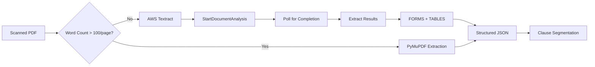

# AWS — Textract OCR & S3 Storage

## Overview

AWS provides two critical services for the AI Contract Risk Analyzer:
1. **Amazon Textract** — OCR for scanned PDFs and image-based contracts
2. **Amazon S3** — Secure storage for uploaded contracts, exports, and backups

---

## Configuration

### Environment Variables

| Variable | Description | Required |
|---|---|---|
| `AWS_ACCESS_KEY_ID` | IAM user access key | ✅ |
| `AWS_SECRET_ACCESS_KEY` | IAM user secret key | ✅ |
| `AWS_REGION` | AWS region (default: `us-east-1`) | ❌ |
| `S3_BUCKET_CONTRACTS` | Bucket for uploaded contracts | ✅ |
| `S3_BUCKET_EXPORTS` | Bucket for generated exports | ✅ |

### IAM Policy

Create an IAM user with the following policy:

```json
{
  "Version": "2012-10-17",
  "Statement": [
    {
      "Effect": "Allow",
      "Action": [
        "textract:StartDocumentAnalysis",
        "textract:GetDocumentAnalysis",
        "textract:StartDocumentTextDetection",
        "textract:GetDocumentTextDetection",
        "s3:PutObject",
        "s3:GetObject",
        "s3:DeleteObject",
        "s3:ListBucket"
      ],
      "Resource": [
        "arn:aws:s3:::contract-risk-edge-contracts/*",
        "arn:aws:s3:::contract-risk-edge-exports/*",
        "arn:aws:textract:us-east-1:*:*"
      ]
    }
  ]
}
```

### Setup Steps

1. Go to https://aws.amazon.com → Create account (free tier)
2. Go to **IAM** → **Users** → **Create user** (`contract-risk-edge-svc`)
3. Attach the policy above
4. Go to **Security credentials** → **Create access key**
5. Copy **Access Key ID** and **Secret Access Key**
6. Create S3 buckets:
   ```bash
   aws s3 mb s3://contract-risk-edge-contracts --region us-east-1
   aws s3 mb s3://contract-risk-edge-exports --region us-east-1
   ```
7. Set environment variables in `.env`

---

## Amazon Textract — OCR Pipeline

### Architecture



### When Textract is Triggered

Textract is used as a fallback when PyMuPDF (primary extractor) returns insufficient text:

```python
async def should_use_ocr(pdf_path: str) -> bool:
    """Determine if OCR is needed."""
    text = extract_text_pymupdf(pdf_path)
    words_per_page = len(text.split()) / max(page_count, 1)
    return words_per_page < 100  # Trigger OCR fallback
```

### API Operations

| Method | Endpoint | Description |
|---|---|---|
| `POST` | `textract:StartDocumentAnalysis` | Start async document analysis |
| `POST` | `textract:StartDocumentTextDetection` | Start async text detection |
| `GET` | `textract:GetDocumentAnalysis` | Get analysis results |
| `GET` | `textract:GetDocumentTextDetection` | Get text detection results |

### Cost

| Service | Price | Per Document (50 pages) |
|---|---|---|
| Textract (FORMS & TABLES) | $0.015/page | $0.75 |
| Textract (detect text only) | $0.0015/page | $0.075 |
| S3 Storage | $0.023/GB/month | ~$0.001 |

---

## Amazon S3 — Storage

### Bucket Structure

```
contract-risk-edge-contracts/
├── tenants/
│   ├── tenant_abc/
│   │   ├── contracts/
│   │   │   ├── 2026/
│   │   │   │   ├── 05/
│   │   │   │   │   ├── {contract_id}.pdf
│   │   │   │   │   └── {contract_id}_extracted.json
│   │   │   └── ...
│   │   └── exports/
│   │       ├── reports/
│   │       └── audit/
│   └── tenant_def/
└── system/
    ├── benchmarks/
    └── backups/
```

### Lifecycle Policy

```json
{
  "Rules": [
    {
      "Id": "ExpireOldContracts",
      "Status": "Enabled",
      "Filter": {"Prefix": "tenants/"},
      "Expiration": {
        "Days": 365
      },
      "Transitions": [
        {
          "Days": 90,
          "StorageClass": "STANDARD_IA"
        },
        {
          "Days": 180,
          "StorageClass": "GLACIER"
        }
      ]
    }
  ]
}
```

### Encryption

```bash
# Enable default encryption on buckets
aws s3api put-bucket-encryption \
  --bucket contract-risk-edge-contracts \
  --server-side-encryption-configuration \
  '{"Rules":[{"ApplyServerSideEncryptionByDefault":{"SSEAlgorithm":"AES256"}}]}'
```

---

## Testing

### Test S3 Access

```bash
# List buckets
aws s3 ls

# Upload a test file
echo "test" | aws s3 cp - s3://contract-risk-edge-contracts/test.txt

# Verify
aws s3 ls s3://contract-risk-edge-contracts/
```

### Test Textract

```bash
# Start document analysis
aws textract start-document-analysis \
  --document-location '{"S3Object":{"Bucket":"contract-risk-edge-contracts","Name":"test_contract.pdf"}}' \
  --feature-types '["FORMS","TABLES"]'

# Check status (use JobId from above)
aws textract get-document-analysis \
  --job-id "JOB_ID_HERE"
```

### Test Python Integration

```bash
cd /Volumes/home/ContractRiskEdge
python3 << 'EOF'
from api.ingestion.extractors.ocr_pipeline import OCRPipeline
import os

pipeline = OCRPipeline(
    aws_access_key=os.getenv("AWS_ACCESS_KEY_ID"),
    aws_secret_key=os.getenv("AWS_SECRET_ACCESS_KEY"),
    region=os.getenv("AWS_REGION", "us-east-1"),
)

# Test with a scanned PDF
result = await pipeline.process_document(
    document_path="/path/to/scanned_contract.pdf",
    document_id="test-001",
)

print(f"Pages processed: {len(result['pages'])}")
print(f"Confidence: {result['confidence']:.1f}%")
EOF
```

---

## Common Issues

| Issue | Cause | Fix |
|---|---|---|
| `AccessDenied` on S3 | Wrong IAM policy | Check bucket policy and IAM permissions |
| `Textract throttling` | Exceeded TPS limit | Implement exponential backoff |
| `Textract timeout` | Document > 3000 pages | Split into smaller documents |
| `S3 bucket not found` | Wrong bucket name | Check `S3_BUCKET_*` in `.env` |
| `CORS error` on upload | No CORS policy on bucket | Add CORS config to S3 bucket |

---

## Related Files

| File | Purpose |
|---|---|
| `api/ingestion/extractors/ocr_pipeline.py` | Textract OCR integration |
| `api/ingestion/extractors/pdf_extractor.py` | PyMuPDF primary extractor |
| `api/services/storage_service.py` | S3 storage operations |
| `infra/terraform/aws/s3.tf` | S3 bucket Terraform config |
| `infra/terraform/aws/iam.tf` | IAM role Terraform config |
