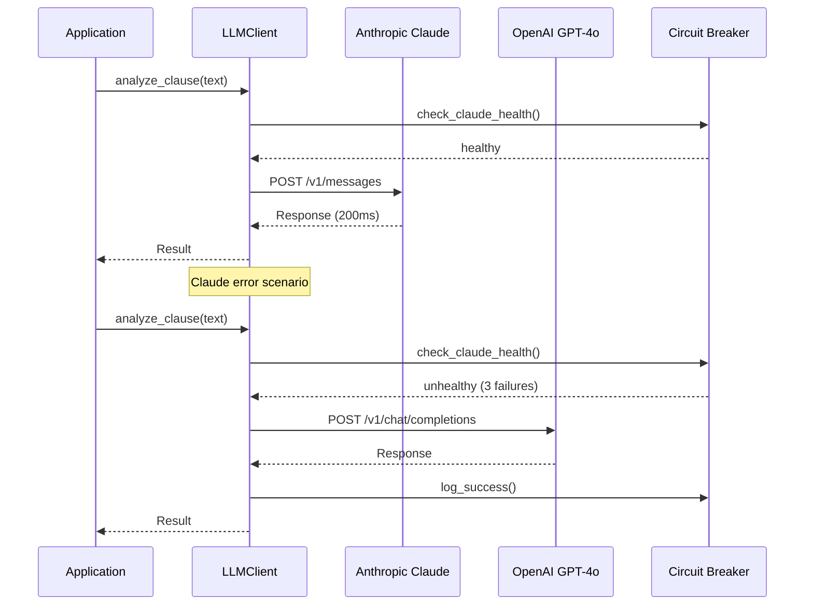
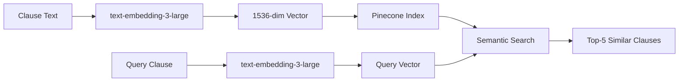

# OpenAI — Fallback LLM & Embeddings

## Overview

OpenAI serves two critical roles in the AI Contract Risk Analyzer:
1. **Fallback LLM Provider** — GPT-4o takes over when Claude is unavailable or slow
2. **Embedding Provider** — `text-embedding-3-large` powers the RAG pipeline for semantic search and clause similarity

---

## Configuration

### Environment Variables

| Variable | Description | Required |
|---|---|---|
| `OPENAI_API_KEY` | OpenAI API key (starts with `sk-`) | ✅ |
| `OPENAI_MODEL` | Fallback model (default: `gpt-4o`) | ❌ |
| `OPENAI_EMBEDDING_MODEL` | Embedding model (default: `text-embedding-3-large`) | ❌ |
| `OPENAI_MAX_TOKENS` | Max output tokens (default: `4096`) | ❌ |

### Setup Steps

1. Go to https://platform.openai.com → Sign up
2. Go to **API Keys** → **Create new secret key**
3. Name it `Contract Risk Analyzer`
4. Copy the key (starts with `sk-`)
5. Go to **Billing** → Add credit card → Set **Usage limits** ($20 monthly recommended)
6. Set `OPENAI_API_KEY` in `.env`

---

## API Endpoints

### Chat Completions (LLM Fallback)

| Method | Endpoint | Description |
|---|---|---|
| `POST` | `https://api.openai.com/v1/chat/completions` | Chat completion (GPT-4o) |
| `POST` | `https://api.openai.com/v1/chat/completions` | Streaming chat completion |

### Embeddings (RAG Pipeline)

| Method | Endpoint | Description |
|---|---|---|
| `POST` | `https://api.openai.com/v1/embeddings` | Create embeddings |
| `POST` | `https://api.openai.com/v1/embeddings` | Batch embeddings (up to 2048 inputs) |

### Request Format — Chat Completion

```json
{
  "model": "gpt-4o",
  "messages": [
    {"role": "system", "content": "You are an expert commercial attorney..."},
    {"role": "user", "content": "Analyze this clause for risk: ..."}
  ],
  "temperature": 0.3,
  "max_tokens": 4096,
  "response_format": { "type": "json_object" }
}
```

### Request Format — Embedding

```json
{
  "model": "text-embedding-3-large",
  "input": "Limitation of Liability. Neither party shall be liable for...",
  "dimensions": 1536
}
```

### Response Format — Embedding

```json
{
  "object": "list",
  "data": [
    {
      "object": "embedding",
      "index": 0,
      "embedding": [0.0023, -0.0101, ...]  // 1536 dimensions
    }
  ],
  "model": "text-embedding-3-large",
  "usage": {
    "prompt_tokens": 45,
    "total_tokens": 45
  }
}
```

---

## Provider Failover Architecture



### Circuit Breaker Configuration

```python
circuit_breaker = {
    "failure_threshold": 3,       # Open after 3 consecutive failures
    "recovery_timeout": 60,       # Try again after 60 seconds
    "half_open_max_requests": 1,  # Test with 1 request in half-open state
}
```

---

## Embedding Pipeline

### Usage in RAG

The embedding pipeline converts clause text into 1536-dimensional vectors for semantic search in Pinecone:



### Batch Processing

```python
from api.rag.embedding import EmbeddingPipeline

pipeline = EmbeddingPipeline(api_key="sk-...")

# Single embedding
vector = await pipeline.embed(
    text="Limitation of Liability clause text...",
)

# Batch embeddings (for corpus ingestion)
vectors = await pipeline.embed_batch(
    texts=[
        "Clause 1 text...",
        "Clause 2 text...",
        # ... up to 100 per batch
    ],
    batch_size=100,
)
```

### Caching Strategy

| Cache Level | Key | TTL | Hit Rate |
|---|---|---|---|
| In-memory LRU | Text hash | 1 hour | ~40% |
| PostgreSQL | Text hash | 24 hours | ~60% |
| Combined | - | - | ~80% |

---

## Cost Tracking

### Pricing (as of May 2026)

| Model | Input (per 1M tokens) | Output (per 1M tokens) |
|---|---|---|
| GPT-4o | $2.50 | $10.00 |
| text-embedding-3-large | $0.13 | - |

### Cost per Operation

| Operation | Avg Tokens | Est. Cost |
|---|---|---|
| Full risk chain (fallback) | 6,000 | $0.035 |
| Single embedding | 50 | $0.0000065 |
| Batch 100 embeddings | 5,000 | $0.00065 |
| **Per Contract (fallback)** | **~120,000** | **~$0.70** |

---

## Testing

### Test Embeddings

```bash
curl -s https://api.openai.com/v1/embeddings \
  -H "Content-Type: application/json" \
  -H "Authorization: Bearer $OPENAI_API_KEY" \
  -d '{
    "model": "text-embedding-3-large",
    "input": "Limitation of Liability clause",
    "dimensions": 1536
  }' | python3 -c "
import sys, json
data = json.load(sys.stdin)
vec = data['data'][0]['embedding']
print(f'Dimensions: {len(vec)}')
print(f'First 5 values: {vec[:5]}')
print(f'Tokens used: {data[\"usage\"][\"total_tokens\"]}')
"
```

### Test Chat Completion

```bash
curl -s https://api.openai.com/v1/chat/completions \
  -H "Content-Type: application/json" \
  -H "Authorization: Bearer $OPENAI_API_KEY" \
  -d '{
    "model": "gpt-4o",
    "messages": [
      {"role": "system", "content": "Respond in JSON format."},
      {"role": "user", "content": "Say hello as JSON: {\"greeting\": \"...\"}"}
    ],
    "response_format": {"type": "json_object"}
  }' | python3 -m json.tool
```

---

## Common Issues

| Issue | Cause | Fix |
|---|---|---|
| `401 Invalid API Key` | Wrong key | Check `OPENAI_API_KEY` in `.env` |
| `429 Rate Limit` | Tier 1 (5 RPM) | Upgrade to Tier 3+; implement retry |
| `Insufficient Quota` | No billing setup | Add payment method in OpenAI dashboard |
| `Embedding dimension mismatch` | Wrong model | Use `text-embedding-3-large` (1536d) |
| `Token limit exceeded` | Clause too long | Truncate to 8K tokens before embedding |

---

## Related Files

| File | Purpose |
|---|---|
| `api/llm/client.py` | LLM client with OpenAI fallback |
| `api/llm/provider.py` | `OpenAIProvider` class (line 436+) |
| `api/rag/embedding.py` | Embedding pipeline with caching |
| `api/rag/vector_store.py` | Pinecone vector store integration |
| `docs/api-details/ANTHROPIC.md` | Primary LLM provider documentation |
| `docs/api-details/PINECONE.md` | Vector database documentation |
