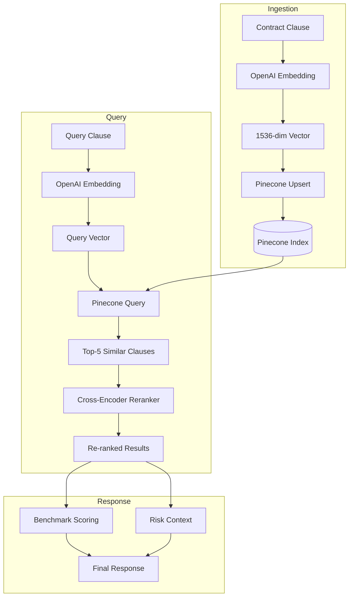

# Pinecone — Vector Database (RAG)

## Overview

Pinecone is the vector database powering the RAG (Retrieval-Augmented Generation) pipeline. It stores 1536-dimensional embeddings of contract clauses and enables semantic similarity search for market benchmarking, clause comparison, and retrieval-augmented risk analysis.

---

## Configuration

### Environment Variables

| Variable | Description | Required |
|---|---|---|
| `PINECONE_API_KEY` | Pinecone API key | ✅ |
| `PINECONE_ENVIRONMENT` | Pinecone environment (e.g., `us-east-1-aws`) | ✅ |
| `PINECONE_INDEX_NAME` | Index name (default: `contract-clauses`) | ❌ |

### Setup Steps

1. Go to https://www.pinecone.io → Sign up (free tier: 100K vectors)
2. Create an **Index**:
   - **Name:** `contract-clauses`
   - **Dimensions:** `1536` (OpenAI text-embedding-3-large)
   - **Metric:** `cosine`
   - **Pod Type:** `p2` for production, `s1` for development
   - **Cloud:** `AWS`
   - **Region:** `us-east-1`
3. Go to **API Keys** → Copy key
4. Set `PINECONE_API_KEY` and `PINECONE_ENVIRONMENT` in `.env`

---

## Index Configuration

### Production Specs

| Setting | Development | Production |
|---|---|---|
| Pod Type | `s1.x1` | `p2.x2` |
| Replicas | 1 | 2 |
| Dimensions | 1536 | 1536 |
| Metric | cosine | cosine |
| Capacity | ~50K vectors | ~10M+ vectors |
| Cost | ~$70/month | ~$700/month |

### Index Metadata

Each vector stores metadata for filtering and result display:

```json
{
  "id": "clause_abc123",
  "values": [0.0023, -0.0101, ...],  // 1536 floats
  "metadata": {
    "clause_id": "clause_abc123",
    "contract_id": "contract_xyz",
    "tenant_id": "tenant_001",
    "clause_type": "liability_exposure",
    "contract_type": "msa",
    "industry": "saas",
    "deal_size_tier": "1-5M",
    "date_indexed": "2026-05-13T00:00:00Z",
    "token_count": 128,
    "quality_score": 0.92
  }
}
```

---

## Namespace Isolation (Multi-Tenant)

Each tenant gets an isolated namespace within the shared index:

```python
# Namespace = f"tenant_{tenant_id}"
namespace = f"tenant_{tenant_id}"
```

This ensures:
- Tenant A's vectors are invisible to Tenant B
- Queries only search within the tenant's namespace
- No cross-tenant data leakage
- Single index cost (vs. per-tenant indexes)

### Query with Namespace

```python
results = index.query(
    namespace=f"tenant_{tenant_id}",
    vector=query_vector,
    top_k=5,
    include_metadata=True,
    filter={
        "clause_type": {"$eq": "liability_exposure"},
        "industry": {"$eq": "saas"},
    }
)
```

---

## RAG Pipeline Architecture



### Key Components

| Component | File | Purpose |
|---|---|---|
| `PineconeVectorStore` | `api/rag/vector_store.py` | Pinecone client with namespace isolation |
| `EmbeddingPipeline` | `api/rag/embedding.py` | OpenAI embedding with caching |
| `RAGPipeline` | `api/rag/pipeline.py` | Full RAG orchestration |
| `CrossEncoderReranker` | `api/rag/reranker.py` | Precision improvement via re-ranking |

---

## API Operations

### Upsert Vectors

```python
from api.rag.vector_store import PineconeVectorStore

store = PineconeVectorStore(
    api_key="pcsk_...",
    environment="us-east-1-aws",
    index_name="contract-clauses",
)

await store.upsert(
    vectors=[
        {
            "id": "clause_001",
            "values": [0.0023, ...],  # 1536 floats
            "metadata": {
                "clause_id": "clause_001",
                "tenant_id": "tenant_abc",
                "clause_type": "liability_exposure",
            }
        }
    ],
    namespace="tenant_abc",
)
```

### Query Similar Clauses

```python
results = await store.query(
    vector=query_vector,  # 1536-dim from embedding
    top_k=5,
    namespace="tenant_abc",
    filter={
        "clause_type": {"$eq": "liability_exposure"},
    },
    include_metadata=True,
)

for match in results.matches:
    print(f"Score: {match.score:.3f}")
    print(f"Clause: {match.metadata['clause_id']}")
```

### Delete Vectors

```python
# Delete by ID
await store.delete(
    ids=["clause_001", "clause_002"],
    namespace="tenant_abc",
)

# Delete by filter
await store.delete(
    filter={"contract_id": {"$eq": "contract_xyz"}},
    namespace="tenant_abc",
)

# Delete entire namespace (tenant deletion)
await store.delete_all(namespace="tenant_abc")
```

---

## Re-ranking Strategy

After Pinecone returns top-5 results, a cross-encoder re-ranks for precision:

```python
from sentence_transformers import CrossEncoder

reranker = CrossEncoder("cross-encoder/ms-marco-MiniLM-L-6-v2")

pairs = [
    (query_text, result.metadata["clause_text"])
    for result in raw_results
]
scores = reranker.predict(pairs)

# Re-sort by cross-encoder score
ranked = sorted(
    zip(raw_results, scores),
    key=lambda x: x[1],
    reverse=True,
)
```

**Impact:** +10-15% precision improvement over raw cosine similarity.

---

## Cost Tracking

### Pinecone Pricing

| Tier | Pod Type | Vectors | Monthly Cost |
|---|---|---|---|
| Starter | `s1.x1` | 50K | ~$70 |
| Growth | `p1.x1` | 500K | ~$200 |
| Pro | `p2.x2` | 5M | ~$700 |
| Enterprise | Custom | 10M+ | Custom |

### Embedding Costs (via OpenAI)

| Volume | Vectors | Embedding Cost | Storage Cost | Total |
|---|---|---|---|---|
| Per contract (avg 200 clauses) | 200 | $0.0013 | - | $0.0013 |
| Monthly (1,000 contracts) | 200K | $1.30 | ~$70 | ~$71 |
| Yearly (10K contracts) | 2M | $13 | ~$200 | ~$213 |

---

## Testing

### Test Pinecone Connection

```bash
cd /Volumes/home/ContractRiskEdge
python3 << 'EOF'
from api.rag.vector_store import PineconeVectorStore
import os

store = PineconeVectorStore(
    api_key=os.getenv("PINECONE_API_KEY"),
    environment=os.getenv("PINECONE_ENVIRONMENT", "us-east-1-aws"),
    index_name=os.getenv("PINECONE_INDEX_NAME", "contract-clauses"),
)

# Test connection
stats = await store.describe_index_stats()
print(f"Index: {stats['index_name']}")
print(f"Total vectors: {stats['total_vector_count']}")
print(f"Namespaces: {list(stats['namespaces'].keys())}")
EOF
```

### Test Full RAG Pipeline

```bash
python3 << 'EOF'
from api.rag.pipeline import RAGPipeline
import os

pipeline = RAGPipeline()

results = await pipeline.retrieve_similar(
    clause_text="Limitation of Liability. Neither party shall be liable...",
    top_k=5,
    tenant_id="tenant_abc",
    filters={"clause_type": "liability_exposure"},
)

print(f"Found {len(results)} similar clauses:")
for r in results:
    print(f"  Score: {r.score:.3f} | Type: {r.metadata['clause_type']}")
EOF
```

---

## Common Issues

| Issue | Cause | Fix |
|---|---|---|
| `Index not found` | Wrong index name | Check `PINECONE_INDEX_NAME` in `.env` |
| `Dimension mismatch` | Wrong embedding model | Use 1536d (text-embedding-3-large) |
| `Namespace not found` | No vectors in namespace | Verify tenant_id matches |
| `Query timeout` | Index too small for data | Scale up pod type |
| `High latency (>200ms)` | No SSD pod | Use `p2` pods instead of `s1` |
| `Cost too high` | Over-provisioned | Reduce replicas; use serverless |

---

## Related Files

| File | Purpose |
|---|---|
| `api/rag/vector_store.py` | Pinecone client with namespace isolation |
| `api/rag/embedding.py` | OpenAI embedding pipeline |
| `api/rag/pipeline.py` | RAG orchestration layer |
| `api/rag/reranker.py` | Cross-encoder re-ranking |
| `ml/benchmarking/corpus_ingestion.py` | Benchmark corpus ingestion pipeline |
| `docs/api-details/OPENAI.md` | Embedding provider documentation |
