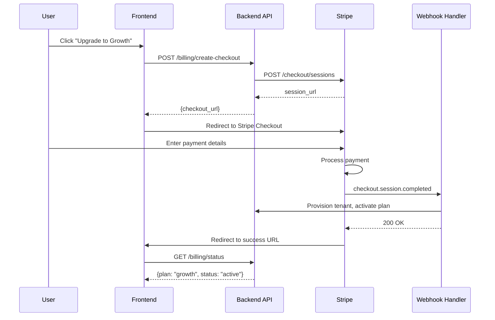
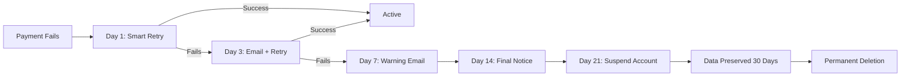

# Stripe — Billing & Subscriptions

## Overview

Stripe handles all billing for the AI Contract Risk Analyzer, including subscription management, usage-based overages, invoicing, and automated dunning. The system supports monthly and annual billing with a 20% annual discount.

---

## Configuration

### Environment Variables

| Variable | Description | Required |
|---|---|---|
| `STRIPE_SECRET_KEY` | Stripe secret key (starts with `sk_test_` or `sk_live_`) | ✅ |
| `STRIPE_PUBLISHABLE_KEY` | Stripe publishable key (starts with `pk_test_` or `pk_live_`) | ✅ |
| `STRIPE_WEBHOOK_SECRET` | Webhook signing secret (starts with `whsec_`) | ✅ |
| `STRIPE_STARTER_PRICE_ID` | Price ID for Starter tier | ✅ |
| `STRIPE_GROWTH_PRICE_ID` | Price ID for Growth tier | ✅ |
| `STRIPE_PRO_PRICE_ID` | Price ID for Professional tier | ✅ |

### Setup Steps

1. Go to https://stripe.com → Sign up
2. Go to **Developers** → **API Keys** → Copy keys
3. Go to **Products** → **Add Product** for each tier
4. Set up **Webhooks** → **Add endpoint** → `https://your-domain.com/api/v1/webhooks/stripe`
5. Set `STRIPE_*` variables in `.env`

---

## Pricing Tiers

| Tier | Monthly | Annual | Contracts/Month | Users | Features |
|---|---|---|---|---|---|
| **Starter** | $500 | $4,800 ($400/mo) | 20 | 3 | PDF/DOCX ingestion, risk flagging, 5 redline types, email support |
| **Growth** | $1,500 | $14,400 ($1,200/mo) | 100 | 15 | All Starter + benchmarking, playbook builder, CRM integration |
| **Professional** | $3,500 | $33,600 ($2,800/mo) | 500 | 50 | All Growth + batch processing, counterparty risk, multi-language |
| **Enterprise** | Custom | Custom | Unlimited | Unlimited | All Pro + white-label, SSO/SCIM, custom RAG, dedicated CSM |

### Stripe Product Configuration

Create these products in Stripe Dashboard → **Products**:

| Product Name | Price (Monthly) | Price (Annual) | Metered Feature |
|---|---|---|---|
| `Starter` | price_starter_monthly ($500) | price_starter_annual ($4,800) | Contract count (20 included) |
| `Growth` | price_growth_monthly ($1,500) | price_growth_annual ($14,400) | Contract count (100 included) |
| `Professional` | price_pro_monthly ($3,500) | price_pro_annual ($33,600) | Contract count (500 included) |
| `Contract Overage` | price_overage ($10 per 10 contracts) | - | Usage-based billing |

---

## API Endpoints

### Stripe API

| Method | Endpoint | Description |
|---|---|---|
| `POST` | `https://api.stripe.com/v1/checkout/sessions` | Create checkout session |
| `POST` | `https://api.stripe.com/v1/subscriptions` | Create subscription |
| `GET` | `https://api.stripe.com/v1/subscriptions/{id}` | Get subscription |
| `POST` | `https://api.stripe.com/v1/subscriptions/{id}` | Update subscription |
| `DELETE` | `https://api.stripe.com/v1/subscriptions/{id}` | Cancel subscription |
| `POST` | `https://api.stripe.com/v1/invoices` | Create invoice |
| `GET` | `https://api.stripe.com/v1/invoices` | List invoices |
| `POST` | `https://api.stripe.com/v1/usage_records` | Report usage (overage) |
| `GET` | `https://api.stripe.com/v1/customers` | List customers |
| `POST` | `https://api.stripe.com/v1/customers` | Create customer |

### Platform Webhook Endpoints

| Event | Handler | Action |
|---|---|---|
| `checkout.session.completed` | `webhooks/stripe.py` | Provision tenant, activate subscription |
| `invoice.paid` | `webhooks/stripe.py` | Update billing status |
| `invoice.payment_failed` | `webhooks/stripe.py` | Send dunning email, retry payment |
| `customer.subscription.updated` | `webhooks/stripe.py` | Handle plan changes |
| `customer.subscription.deleted` | `webhooks/stripe.py` | Suspend tenant access |
| `customer.subscription.trial_will_end` | `webhooks/stripe.py` | Send trial-ending notification |

---

## Subscription Flow



---

## Usage-Based Overage Billing

### How It Works

1. Each tier includes a contract count limit
2. When a tenant exceeds their limit, the system records usage
3. Usage is reported to Stripe nightly via `createUsageRecord()`
4. Stripe invoices the customer at the end of the billing period

### Implementation

```python
import stripe
from datetime import datetime

async def report_usage(subscription_item_id: str, quantity: int):
    """Report contract overage usage to Stripe."""
    stripe.UsageRecord.create(
        subscription_item=subscription_item_id,
        quantity=quantity,
        timestamp=int(datetime.utcnow().timestamp()),
        action="increment",
    )
```

### Overage Pricing

| Tier | Included | Overage Rate |
|---|---|---|
| Starter | 20 contracts/mo | $10 per 10 contracts |
| Growth | 100 contracts/mo | $8 per 10 contracts |
| Professional | 500 contracts/mo | $5 per 10 contracts |

---

## Dunning (Failed Payment Recovery)



### Email Templates

| Day | Subject | Content |
|---|---|---|
| 1 | Payment declined | "Your payment of $X was declined. We'll retry automatically." |
| 7 | Action needed | "Multiple payment attempts have failed. Update your payment method." |
| 14 | Final notice | "Your account will be suspended in 7 days if payment is not received." |
| 21 | Account suspended | "Your account has been suspended. Your data is preserved for 30 days." |

---

## Testing

### Test Mode

Stripe provides test card numbers for development:

| Card Number | Scenario |
|---|---|
| `4242 4242 4242 4242` | Success |
| `4000 0000 0000 0002` | Decline |
| `4000 0025 0000 3155` | Requires 3D Secure |
| `4000 0000 0000 3220` | Insufficient funds |

### Test Checkout

```bash
# Create a checkout session
curl -s https://api.stripe.com/v1/checkout/sessions \
  -u "sk_test_your_key:" \
  -d "mode=subscription" \
  -d "success_url=http://localhost:3000/billing/success" \
  -d "cancel_url=http://localhost:3000/billing/cancel" \
  -d "line_items[0][price]=price_starter_monthly" \
  -d "line_items[0][quantity]=1" \
  | python3 -m json.tool
```

### Test Webhooks Locally

```bash
# Install Stripe CLI
brew install stripe/stripe-cli/stripe

# Forward webhooks to local server
stripe listen --forward-to localhost:8000/api/v1/webhooks/stripe

# Trigger test events
stripe trigger checkout.session.completed
stripe trigger invoice.payment_failed
stripe trigger customer.subscription.deleted
```

---

## Common Issues

| Issue | Cause | Fix |
|---|---|---|
| `Checkout session expired` | Session > 24h | Create new session |
| `Webhook signature invalid` | Wrong `STRIPE_WEBHOOK_SECRET` | Copy from Stripe Dashboard → Webhooks |
| `Price ID not found` | Wrong price ID | Verify `STRIPE_*_PRICE_ID` in `.env` |
| `Usage record duplicate` | Same timestamp + subscription | Use `unique_id` parameter |
| `Tier downgrade conflicts` | Over-limit on new tier | Warn user; offer to upgrade or reduce usage |

---

## Related Files

| File | Purpose |
|---|---|
| `api/routers/billing.py` | Billing API endpoints |
| `api/services/billing_service.py` | Billing business logic |
| `api/webhooks/stripe.py` | Stripe webhook handler |
| `api/models/billing.py` | Billing data models |
| `frontend/src/app/billing/` | Billing UI components |
